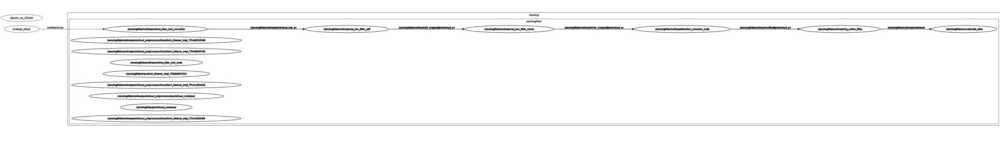

# NUSRI-23-24-P22

NUSRI AY23/24 Final Year Project NO.22

## Related Repositories

* [ ] Autoware: [autoware.p22](https://github.com/TangLongbin/autoware.p22)
* [X] C 板代码: [RM_C_Board.p22](https://github.com/TangLongbin/RM_C_Board.p22)
* [X] Vehicle_Launch: [p22_vehicle_launch](https://github.com/NUSRI-P22/p22_vehicle_launch)
* [ ] Sensor_kit_Launch: [p22_sensor_kit_launch](https://github.com/NUSRI-P22/p22_sensor_kit_launch)

  * [X] Lidar
  * [X] Odom
  * [ ] Radar
* [ ] P22_individual_params: [p22_individual_params](https://github.com/NUSRI-P22/p22_individual_params)
* [X] Autoware_launch.p22: [autoware_launch.p22](https://github.com/NUSRI-P22/autoware_launch.p22)
* [ ] Autoware.universe.p22: [autoware.universe.p22](https://github.com/NUSRI-P22/autoware.universe.p22)
* [X] UnilidarSDK: [unilidar_sdk](https://github.com/NUSRI-P22/unilidar_sdk)

## [PCL] in UnilidarSDK

Because `pcl` is not an official ros2 package, there will show `definition error` while using `rosdep` to install packages.

To deal with this problem, `<depend>pcl</depend>` was commented in `package.xml` since `<depend>pcl_conversions</depend>` will automatically install `pcl`.

If there is any problem with `pcl`, you can uncomment it in `package.xml`.

## Temporary Rosbag

You should first use ``cd``command to the change to the corresponging dictionary.
And then run the command below to download and unzip the rosbag

```shell
gdown  14XoxOpdKZp0c853ZE7vyyiFOkyqw44-L
unzip rosbag2_2024_01_23-23_12_46.zip
```

## Launch Sensor_kit

* Make sure you have updated the workspace by using vcs tool. In that case, you will have those files:

```shell
autoware.p22/src/sensor_kit/p22_sensor_kit_launchautoware.p22(make sure this is the only sensor kit, otherwise, it will not work.)
autoware.p22/src/sensor_kit/external/unilidar_sdk
```

* Build necessary packages:

```shell
cd <your-workspace>/autoware.p22
colcon build --packages-up-to tier4_sensing_launch p22_sensor_kit_launch
source install/setup.bash
ros2 launch tier4_sensing_launch sensing.launch.xml sensor_model:=p22_sensor_kit
```

* If no ERROR, you can check the topics/nodes in **a new terminal**:

```shell
ros2 topic list
or
ros2 node list
or
rqt_graph
```

* Key topics/nodes will be shown like:

```shell
/sensing/lidar/*
/sensing/imu/*
/sensing/vehicle_velocity_converter/*
/unilidar/cloud
```

* Play the rosbag to check pointcloud:

```shell
ros2 bag play <your-rosbag>
```

* Check the topics/nodes again, and the data flow shows like this:



* Echo the last output topic to check the data:

```shell
ros2 topic echo /sensing/lidar/concatenated/pointcloud

there should be data printed if the rosbag is playing.
```
